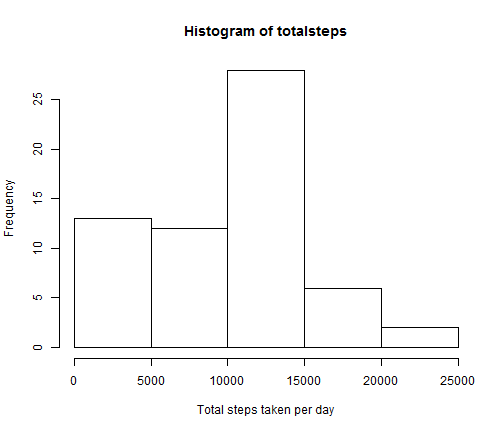
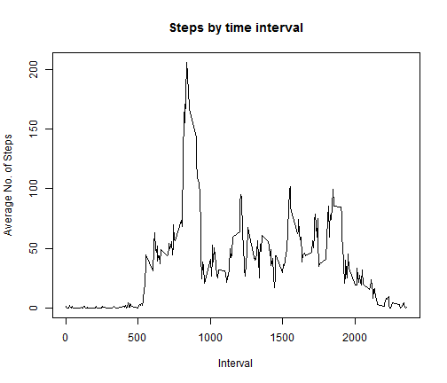
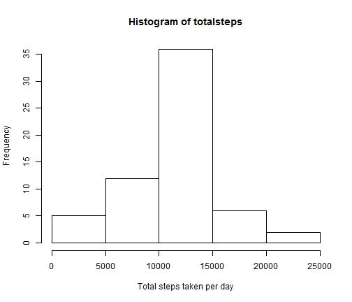
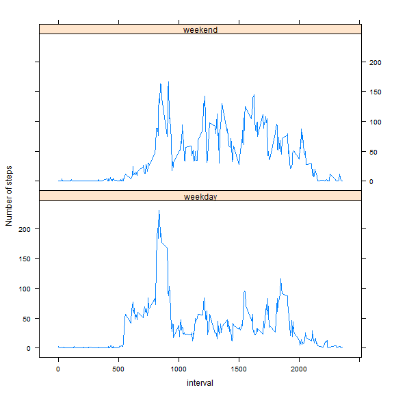

# Reproducible Research: Peer Assessment 1


## Loading and preprocessing the data

Data is loaded from CSV file. The only transformation needed at this stage is conversion of 
dates from factor variable to proper Date format.

```r
# load the activity data set
da = read.csv("activity.csv")
# transform to proper date format
da$date = as.Date(da$date, format = "%Y-%m-%d")
```


## What is mean total number of steps taken per day?

1. Histogram of the total number of steps taken per day


```r
# split the data into dates
splitda = split(da, da$date)
# total number of steps taken each day
totalsteps = sapply(splitda, function(x) sum(x$steps, na.rm = TRUE))
# histogram of the total number of steps taken each day
hist(totalsteps, xlab = "Total steps taken per day")
```

 


2. Mean and median of the total steps aggregated by day


```r
# mean: total number of step taken each day, averaged over all days
mean(totalsteps)
```

```
## [1] 9354
```

```r
# median: median of total number of step taken each day
median(totalsteps)
```

```
## [1] 10395
```


## What is the average daily activity pattern?

Split the data by the time slot in each day, and average over all the days. Make a time series 
plot of the average number of steps for each time slot.

```r
# split the data by the time slot in the day
splitda = split(da, da$interval)
# average across all days
averagesteps = sapply(splitda, function(x) mean(x$steps, na.rm = TRUE))

# Make a time series plot of the average steps in each time slot
plot(names(averagesteps), as.numeric(averagesteps), type = "l", xlab = "Interval", 
    ylab = "Average No. of Steps", main = "Steps by time interval")
```

 


Report the time slot with the maximum number of steps: 

```r
# find the interval with peak number of steps
peak = which(averagesteps == max(averagesteps))
peak
```

```
## 835 
## 104
```

The time interval 835 had the maximum number of steps during a day. (This was at
sl # 104 in the list).

## Imputing missing values

Total number of NA values in the steps column:

```r
# number of missing values
sum(is.na(da$steps))
```

```
## [1] 2304
```


Make a new copy of the data set. Replace missing values with the average number of steps 
taken in that time slot, averaged across all days.

```r
# make a fresh copy of the data set
da2 = da
# Capture the location of the missing values
w = which(is.na(da2$steps))
# impute missing values
da2$steps[w] = averagesteps[as.character(da2$interval[w])]
# split the new data set according to the dates
splitda = split(da2, da2$date)
# total number of steps taken each day
totalsteps = sapply(splitda, function(x) sum(x$steps, na.rm = TRUE))
```


Make a histogram of the new data set.

```r
# histogram of the total number of steps taken each day
hist(totalsteps, xlab = "Total steps taken per day")
```

 


Find the mean and median of the total steps:

```r
# mean: total number of step taken each day, averaged over all days
mean(totalsteps)
```

```
## [1] 10766
```

```r
# median: median of total number of step taken each day
median(totalsteps)
```

```
## [1] 10766
```


We see that replacing the missing values with the average number of steps has 3 effects: (1) It pushed the mean and mode upwards (2) Made the mean and mode equal (3) Reduced the skewness in the distribution.

## Are there differences in activity patterns between weekdays and weekends?

Split the data set to compute the average steps taken during week days and week ends:


```r
# function to calculate average steps taken during each time interval Takes
# as input all days of one type (week day/ week end) first it splits the
# data by time intervals
f = function(dafr, category) {
    # dafr: data frame containing one category of days, namely week days or week
    # ends category: string indicating week day or week end
    splitda = split(dafr, dafr$interval)
    avesteps = sapply(splitda, function(x) mean(x$steps, na.rm = TRUE))
    namez = as.numeric(names(avesteps))
    # rearrange them by increasing order of time interval
    ord = order(namez)
    valz = as.numeric(avesteps)
    # return as a data frame
    return(data.frame(interval = namez[ord], avesteps = valz[ord], wkdaywkend = category))
}

# introduce a factor variable indicating week day/ week end
da2$wkdaywkend = ifelse((weekdays(da2$date) == "Saturday" | weekdays(da2$date) == 
    "Sunday"), "weekend", "weekday")
da2$wkdaywkend = as.factor(da2$wkdaywkend)
spda = split(da2, da2$wkdaywkend)
# aggregate: find average steps taken in each time slot
dataframe = f(spda[[1]], "weekday")
tmpframe = f(spda[[2]], "weekend")
dataframe = rbind(dataframe, tmpframe)
```


Visually compare the average steps taken in each time interval for week days and week ends:

```r
# Plot to compare average steps in each time slot over week days/ week ends
library(lattice, warn.conflicts = FALSE, quietly = TRUE)
```

```
## Warning: package 'lattice' was built under R version 3.0.3
```

```r
xyplot(avesteps ~ interval | wkdaywkend, data = dataframe, type = "l", layout = c(1, 
    2), ylab = "Number of steps")
```

 


The figure shows that the subjects started moving about late in the morning during week ends. The peak morning activity (around interval 800) was also much smaller over week ends. There was late evening activity (around interval 2000) during week ends.
